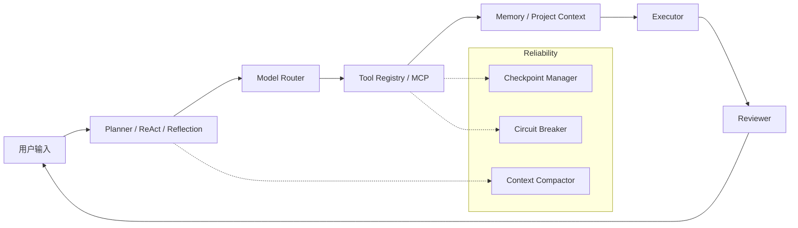

# OmniAgent: Local Multi-Model Agent Runtime / Coding Agent CLI

[](https://github.com/xianyu-sheng/omniagent/actions/workflows/ci.yml)

OmniAgent is a local-first coding agent CLI for developers who want a transparent, configurable agent runtime: multi-model routing, ReAct / Plan-Execute / Reflection workflows, MCP tools, memory, project context, and production-grade reliability features in one Python package.


## Why It Matters

| Capability | What it gives you |
| --- | --- |
| Multi-model runtime | Route work across DeepSeek, OpenAI, Claude, Gemini, Qwen, Ollama, and other providers. |
| Agent workflows | Switch between direct chat, ReAct tool use, Plan-Execute, Reflection, and combined modes. |
| Local tool execution | Read/write files, search code, run commands, inspect git, fetch web/GitHub content, and call MCP tools. |
| High-speed search | Ripgrep-backed file search with automatic Python `re` fallback, glob & file-type filtering. |
| Context compression | 6-section structured compaction triggered at 80% context window, keeping critical state intact. |
| Sub-agent system | Spawn background sub-agents with full tool access via ReAct engine, with concurrency control. |
| Write-before checkpoint | Automatic file backup before destructive writes; Guard context manager for exception-safe edits. |
| Circuit breaker | 3 consecutive tool failures → cooldown (30s base, exponential backoff to 5min max) → 1 retry. |
| Test runner | Built-in pytest wrapper with output parsing (passed/failed/errors/skipped/failures) + command tool. |
| Session lifecycle | Auto-cleanup of old sessions (7d), runs (30d), and checkpoints (14d) on startup. |
| MCP daemon | Auto-restart crashed MCP subprocess (max 3 restarts with delay backoff). |
| Code quality | `mypy strict` for new modules, comprehensive `ruff` ruleset (E/F/I/UP/B/C4/SIM/RUF/PERF). |

## Quick Start

```bash
git clone https://github.com/xianyu-sheng/omniagent.git
cd omniagent
pip install -e ".[dev]"
omniagent
```

Inside the CLI:

```text
You: /setup
You: /set_model
You: /mode react
You: !python -m pytest tests -q
You: /new_terminal
You: 帮我检查 tests 失败原因并给出修复方案
```

API keys are stored locally in `~/.omniagent/credentials.yaml`. You can also pass models directly:

```bash
omniagent chat -m deepseek/deepseek-v4-pro openai/gpt-4o
```

## Architecture



- **Planner / ReAct / Reflection** chooses how the agent reasons: direct answer, tool loop, plan execution, or review.
- **Model Router** resolves provider/model priority and fallback behavior.
- **Tool Registry / MCP** exposes local tools plus external MCP servers.
- **Memory / Project Context** injects conversation history, rules, file tree, and saved memories.
- **Checkpoint Manager** auto-saves file copies before destructive writes; restores on failure.
- **Circuit Breaker** prevents infinite retry loops: 3 consecutive failures → cooldown → 1 retry.
- **Context Compactor** compresses conversation at 80% context window with 6-section structured summary.
- **Executor** and **Reviewer** turn plans into actions, validate outputs, and surface results back to the CLI.

## Common Commands

| Command | Purpose |
| --- | --- |
| `/setup` | Configure provider API keys, default models, and modes. |
| `/set_model` | Register or interactively select a model. Configured providers load model options from their live API; built-in examples are used only when refresh is disabled. |
| `/mode` | Switch between direct, react, plan-execute, reflection, and combined modes. |
| `/project` | Inspect detected project type, file tree, and project rules. |
| `/edit <file> <instruction>` | Ask the LLM to edit a file and review the diff before applying. |
| `/mcp` | Add/list/remove MCP servers and inspect external tools. |
| `/memory` | Manage cross-session memory. |
| `/compact` | Summarize long context to control token usage. |
| `/session [thread]` | Inspect the current runtime session and recent thread messages. |
| `/notes [add <text>]` | View or append durable notes for the current runtime session. |
| `/runs [run_id]` | List recent agent runs or inspect a run's event log path and event summary. |
| `/policy` | Inspect static tool permission policy and local policy file guidance. |
| `!<command>` | Run a shell command directly from the OmniAgent input line with the existing safety checks. |
| `/shell <command>` | Slash-command form of direct shell execution. |
| `/new_terminal [cwd]` | Open an observable child terminal. On Windows Terminal it uses a split pane; otherwise it opens a new shell window. |
| `/terminal_status [lines]` | Read the latest child-terminal transcript output. |
| `/terminal_quote [lines]` | Quote recent child-terminal output into the current OmniAgent context for follow-up questions. |
| `/open <file[:line]>` | Open a local file in the configured editor, VS Code, or the OS default app. |
| `/checkpoint [list\|restore <path>\|rollback]` | Manage file checkpoints: list backups, restore a file, or rollback all session changes. |
| `/cleanup [run\|stats\|dry-run]` | Clean expired session data, runs, and checkpoints; view storage statistics. |

The REPL input uses `prompt_toolkit` when available, so Left/Right/Home/End can move inside the current command and edit text in the middle. `Shift+Enter` inserts a new line; `Enter` sends.

## Eval

OmniAgent includes a small 20-task agent eval suite in `evals/tasks.yaml`.

Mock Eval is deterministic and used by CI:

```bash
python evals/runner.py --mode mock --output evals/reports/mock_report.md
```

Real Eval uses your configured model and API key. It is manual by design and is not run in CI:

```bash
python evals/runner.py --mode real --model deepseek/deepseek-v4-pro --output evals/reports/real_report.md
python evals/runner.py --mode real --model openai/gpt-4o --output evals/reports/real_report.md
```

The report records task count, success rate, average token estimate, tool calls, tool failures, and failure summaries. See `evals/reports/sample_report.md` for the real-eval report shape, then replace it with a freshly generated local run before using it as portfolio evidence.

## Testing

```bash
python -m pytest tests -q                   # Standard pytest suite
python tests/test_p0_fixes.py               # P0: Compactor, ripgrep, sub-agent (46 tests)
python tests/test_p1_fixes.py               # P1: Checkpoint, Pytest, CircuitBreaker (43 tests)
python tests/test_real_ops.py               # Real-world operations (33 scenarios)
python tests/test_multi_angle.py            # Multi-angle comprehensive (121 tests)
python evals/runner.py --mode mock --output evals/reports/mock_report.md
```

The test suite covers REPL commands, tools, memory, project context, callbacks, prompt optimization, code indexing, checkpoint lifecycle, circuit breaker states, context compaction, session cleanup, sub-agent registry, and the eval runner. The root-level `test_all_modules.py` is a manual integration script and can make real API/tool calls, so it is not part of default CI.

## Security

Supported today:

- API keys are stored locally in `~/.omniagent/credentials.yaml`.
- **Write-before checkpoint**: files are auto-backed up before destructive writes; restored automatically on failure.
- File edits can be reviewed as diffs before confirmation.
- Dangerous shell and git commands are blocked or require explicit confirmation paths.
- Sensitive paths and common credential filenames are guarded in tool operations.
- **Circuit breaker** prevents runaway retry loops: 3 consecutive failures → cooldown (30s–5min) → single retry.
- Each interactive agent run writes an append-only event log to `.omniagent/sessions/<session_id>/runs/<run_id>/events.jsonl`, covering run start/finish, thoughts, tool calls, steps, reviews, model selection, and usage estimates.
- Each interactive REPL session also has a project-local `.omniagent/sessions/<session_id>/thread.jsonl` and `notes.md`; notes are reinjected into later turns as durable session context.
- Static tool permission policy can be customized in `.omniagent/policy.yaml`, for example denying `npm publish*` commands or writes to `*.secret`.
- **Session auto-cleanup** removes expired sessions (7d), runs (30d), and checkpoints (14d) on startup.
- **MCP auto-restart** revives crashed MCP subprocesses (max 3 restarts with backoff).

Planned:

- Fine-grained workspace sandbox policy.
- Interactive per-tool approval with allow-once / always-allow / always-deny decisions.
- Richer trace replay and UI views built on top of run event logs.

## Project Rules

Create `.omniagent/rules.md` in your project root to guide the agent:

```markdown
# Project Rules
- Use Python 3.12.
- Prefer pytest for tests.
- Show diffs before editing tracked source files.
- Keep API keys and credentials out of the repository.
```

## License

MIT License

## Credits

- [Rich](https://github.com/Textualize/rich) for terminal UI
- [httpx](https://github.com/encode/httpx) for HTTP calls
- [PyYAML](https://github.com/yaml/pyyaml) for YAML parsing
