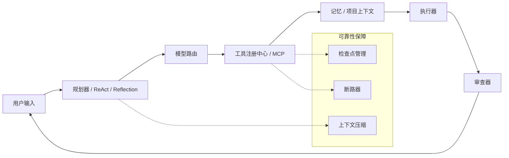

# OmniAgent: 本地多模型 AI 编程助手 CLI

[](https://github.com/xianyu-sheng/omniagent/actions/workflows/ci.yml)

OmniAgent 是一个本地优先的 AI 编程助手命令行工具，为开发者提供透明、可配置的 Agent 运行时：支持多模型路由、ReAct / Plan-Execute / Reflection 工作流、MCP 工具、记忆系统、项目上下文，以及生产级可靠性保障。

## 📹 项目使用演示

[](./demo.mp4)

> 👆 **点击上方预览图**即可在 GitHub 上观看完整使用演示（含安装配置、多模式切换、工具调用、Agent 工作流等全流程）

## 核心能力

| 能力 | 说明 |
| --- | --- |
| 多模型运行时 | 支持 DeepSeek、OpenAI、Claude、Gemini、Qwen、Ollama 等多种模型提供商自由切换 |
| Agent 工作流 | 在直接对话、ReAct 工具调用、Plan-Execute 规划执行、Reflection 反思等模式间切换 |
| 本地工具执行 | 读写文件、搜索代码、执行命令、Git 操作、网页抓取、GitHub 仓库访问、MCP 工具调用 |
| 高速搜索 | 基于 Ripgrep 的文件内容搜索，支持 glob 过滤和文件类型筛选，自动回退 Python `re` |
| 上下文压缩 | 达到 80% 上下文窗口时触发 6 段式结构化压缩，保留关键状态 |
| 子 Agent 系统 | 通过 ReAct 引擎在后台派生子 Agent，具备完整工具访问和并发控制能力 |
| 写入前检查点 | 破坏性写入前自动备份文件，异常时自动恢复；Guard 上下文管理器保证异常安全 |
| 断路器保护 | 工具连续失败 3 次 → 进入冷却期（30 秒起，指数退避最大 5 分钟）→ 允许 1 次重试 |
| 测试运行器 | 内置 pytest 封装，支持输出解析（通过/失败/错误/跳过） |
| 会话生命周期 | 启动时自动清理过期会话（7 天）、运行记录（30 天）和检查点（14 天） |
| MCP 守护进程 | MCP 子进程崩溃后自动重启（最多 3 次，延迟退避） |
| 代码质量 | 新模块 `mypy strict`，完善的 `ruff` 规则集（E/F/I/UP/B/C4/SIM/RUF/PERF） |

## 快速开始

```bash
git clone https://github.com/xianyu-sheng/omniagent.git
cd omniagent
pip install -e ".[dev]"
omniagent
```

进入 CLI 后：

```text
You: /setup              # 首次配置 API Key
You: /set_model          # 注册或切换模型
You: /mode react         # 选择思考范式
You: !pytest tests -q    # 直接运行测试
You: /new_terminal       # 打开可观测子终端
You: 帮我检查 tests 失败原因并给出修复方案
```

API Key 存储在本地 `~/.omniagent/credentials.yaml`。也可以通过命令行直接指定模型：

```bash
omniagent chat -m deepseek/deepseek-v4-pro openai/gpt-4o
```

## 架构



- **规划器 / ReAct / Reflection**：决定 Agent 如何思考——直接回答、工具循环、计划执行或反思审查
- **模型路由**：解析模型优先级和回退策略
- **工具注册中心 / MCP**：暴露本地工具和外部 MCP 服务器
- **记忆 / 项目上下文**：注入对话历史、规则、文件树和已保存的记忆
- **检查点管理**：破坏性写入前自动备份，失败时恢复
- **断路器**：防止无限重试——连续失败 3 次 → 冷却 → 1 次重试机会
- **上下文压缩**：在 80% 上下文窗口时压缩对话，使用 6 段式结构化摘要
- **执行器** 和 **审查器**：将计划转化为操作，验证输出，将结果反馈到 CLI

## 常用命令

| 命令 | 用途 |
| --- | --- |
| `/setup` | 配置 API Key、默认模型和模式 |
| `/set_model` | 注册或交互式切换模型 |
| `/mode` | 切换思考范式：direct / react / plan-execute / reflection |
| `/project` | 查看检测到的项目类型、文件树和项目规则 |
| `/edit <文件> <指令>` | 让 LLM 编辑文件，确认前可预览 diff |
| `/mcp` | 添加/列出/移除 MCP 服务器，查看外部工具 |
| `/memory` | 管理跨会话记忆 |
| `/compact` | 压缩长对话上下文，控制 Token 消耗 |
| `/session [thread]` | 查看当前运行时会话和最近消息 |
| `/notes [add <文本>]` | 查看或追加当前会话的持久笔记 |
| `/runs [run_id]` | 列出最近的 Agent 运行记录或查看详情 |
| `/policy` | 查看静态工具权限策略 |
| `!<命令>` | 直接在终端执行命令（带安全校验） |
| `/shell <命令>` | 斜杠命令形式的终端执行 |
| `/new_terminal [目录]` | 打开可观测子终端（Windows Terminal 下分屏打开） |
| `/terminal_status [行数]` | 读取子终端最近的输出 |
| `/terminal_quote [行数]` | 引用子终端输出到当前对话上下文 |
| `/open <文件[:行号]>` | 在编辑器中打开文件 |
| `/checkpoint [list\|restore <路径>\|rollback]` | 管理文件检查点 |
| `/cleanup [run\|stats\|dry-run]` | 清理过期数据，查看存储统计 |

> 💡 使用 `Shift+Enter` 换行输入多行内容，`Enter` 发送。支持 `prompt_toolkit` 的行内编辑。

## 评测

OmniAgent 内置 20 个任务的 Agent 评测套件（`evals/tasks.yaml`）。

Mock 评测（确定性，CI 使用）：

```bash
python evals/runner.py --mode mock --output evals/reports/mock_report.md
```

真实评测（使用已配置的模型，手动运行）：

```bash
python evals/runner.py --mode real --model deepseek/deepseek-v4-pro --output evals/reports/real_report.md
python evals/runner.py --mode real --model openai/gpt-4o --output evals/reports/real_report.md
```

## 测试

```bash
python -m pytest tests -q                   # 标准 pytest 套件
python tests/test_p0_fixes.py               # P0: 压缩器、ripgrep、子 Agent（46 项测试）
python tests/test_p1_fixes.py               # P1: 检查点、pytest 封装、断路器（43 项测试）
python tests/test_real_ops.py               # 真实操作场景（33 个场景）
python tests/test_multi_angle.py            # 多角度综合测试（121 项）
python evals/runner.py --mode mock --output evals/reports/mock_report.md
```

## 安全

已实现：

- API Key 存储在本地 `~/.omniagent/credentials.yaml`
- **写入前检查点**：破坏性写入前自动备份文件，异常时自动恢复
- 文件编辑可预览 diff 后再确认
- 危险 shell 和 git 命令被拦截或需要显式确认
- 敏感路径和常见凭据文件名在工具操作中被保护
- **断路器**阻止失控重试：连续失败 3 次 → 冷却期（30 秒~5 分钟）→ 单次重试
- 每次交互运行写入追加式事件日志（`.omniagent/sessions/<id>/runs/<id>/events.jsonl`）
- 每个 REPL 会话有独立的 `thread.jsonl` 和 `notes.md`，笔记在后续对话中自动注入
- 可通过 `.omniagent/policy.yaml` 自定义工具权限策略
- **会话自动清理**：启动时移除过期会话（7 天）、运行记录（30 天）、检查点（14 天）
- **MCP 自动重启**：崩溃的 MCP 子进程自动重启（最多 3 次，延迟退避）

计划中：

- 细粒度工作区沙箱策略
- 交互式工具审批（单次允许 / 始终允许 / 始终拒绝）
- 基于运行事件日志的追踪回放和 UI 视图

## 项目规则

在项目根目录创建 `.omniagent/rules.md` 来引导 Agent 行为：

```markdown
# 项目规则
- 使用 Python 3.12
- 优先使用 pytest 编写测试
- 修改源文件前展示 diff
- 不要将 API Key 和凭据提交到仓库
```

## 许可证

MIT License

## 致谢

- [Rich](https://github.com/Textualize/rich) — 终端 UI
- [httpx](https://github.com/encode/httpx) — HTTP 请求
- [PyYAML](https://github.com/yaml/pyyaml) — YAML 解析
