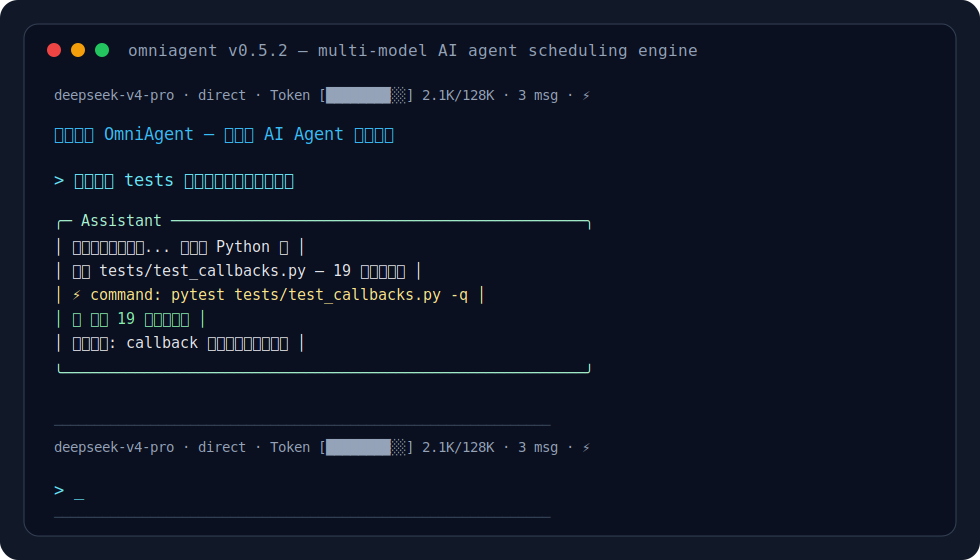

# Xenon

**Where your wildest ideas come to life.**  An AI coding agent with 8 reasoning engines, MCP protocol, and Smithery integration.

[]()
[]()
[]()
[-success.svg)](https://github.com/openai/human-eval)
[](https://github.com/xianyu-sheng/Xenon/releases)



<video src="https://github.com/xianyu-sheng/Xenon/blob/main/docs/assets/demo.webm?raw=true" controls width="100%"></video>

> 👆 完整终端操作录屏，含 dim 日志、引导线输入、斜杠命令、ReAct 工具调用等。

> 12 家模型商、8 种推理范式、MCP + Smithery 7000+ 服务器库、断路器、上下文压缩、28 个内建技能——一个终端 Agent 该有的工程机制，这里都有。
> 23K 行 Python，1110+ 测试，MIT 开源。**适合想深入理解 Agent 架构的开发者阅读、修改、二次开发。**

---

## Xenon vs 主流工具：一句话对比

| 工具 | 本质 | 最适合 |
|------|------|--------|
| **Xenon** | 多范式 Agent 参考实现 + MCP 生态 | 研究 Agent 架构、深度代码重构、多模型调度 |
| **Claude Code** | 官方 Claude 终端助手 | 用 Claude 模型、要 MCP 一等支持 |
| **Aider** | 多模型 git-commit 风格编辑器 | git repo 级代码编辑 |
| **Cursor** | IDE 集成的 AI 编辑器 | 在 IDE 内边写边改 |
| **GitHub Copilot** | IDE 内联补全 | 写代码时的行级/块级补全 |
| **Cline (VS Code)** | 使用 MCP 的 VS Code Agent | VS Code 内用 MCP 工具 |
| **OpenCode** | 多模型 TUI Agent（Go） | 50+ provider、TUI 美观 |
| **Crush** | 多模型 TUI Agent（Go） | 本地多运行时（Ollama 等 5 种） |

---

## 这个项目是什么——以及不是什么

**Xenon 不是** Claude Code 或 Aider 的竞品。它不追求在 SWE-bench 上刷榜，也不试图说服你换掉现有的编程助手。

**Xenon 是**一个把 AI Agent 核心机制做齐、做透的参考实现。如果你想理解：

- ReAct / Plan-Execute / Reflection 到底怎么实现
- MCP 协议如何在真实 Agent 中集成（stdio + SSE + Smithery 注册中心）
- 断路器和预算管理器如何防止 Agent "跑飞"
- 多模型路由和自动降级怎么设计
- 上下文压缩 6 步流水线怎么保留语义最密集内容
- **28 个可复用技能 + 7000+ MCP 服务器一键安装**

——那这个项目就是写给你的。

---

## 快速开始

### 前置条件

- **Python 3.10+**
- **API Key**：至少一个模型商的 API Key（DeepSeek / OpenAI / Anthropic 等）

### 30 秒上手

```bash
git clone https://github.com/xianyu-sheng/Xenon.git
cd xenon
pip install -e ".[dev]"
xenon
```

进 REPL 后三步完成配置和首次使用：

```text
> /setup                              # 配 API key + 选模型（自动加入调用池）
> 你好                                 # 自动根据任务难度选模型
> 帮我写一个快速排序的核心算法              # 复杂任务自动切旗舰模型
```

### 一行命令模式

```bash
# 直接对话
xenon chat -m deepseek/deepseek-v4-pro "review this diff"

# 查看可用模型
xenon chat --list-models

# 指定引擎范式
xenon chat --engine react "帮我排查这个 bug"
```

---

## 架构一览

```
┌─────────────────────────────────────────────────────────┐
│                    Terminal REPL                          │
│  prompt_toolkit 输入 · Rich 渲染 · dim 日志 · 斜杠命令     │
└──────────────────────┬──────────────────────────────────┘
                       │
┌──────────────────────▼──────────────────────────────────┐
│                   Agent 调度层（8 种范式）                  │
│  ┌──────────┐ ┌──────────┐ ┌──────────┐ ┌──────────┐   │
│  │  Direct  │ │  ReAct   │ │  Plan-   │ │Reflection│   │
│  │          │ │          │ │ Execute  │ │          │   │
│  └──────────┘ └──────────┘ └──────────┘ └──────────┘   │
│  ┌──────────┐ ┌──────────┐ ┌──────────┐ ┌──────────┐   │
│  │Plan+React│ │Plan+Refl │ │React+Refl│ │  Novel   │   │
│  └──────────┘ └──────────┘ └──────────┘ └──────────┘   │
└──────────────────────┬──────────────────────────────────┘
                       │
┌──────────────────────▼──────────────────────────────────┐
│                   工程可靠性层                             │
│  ┌──────────┐ ┌──────────┐ ┌──────────┐ ┌──────────┐   │
│  │Compactor │ │ Budget   │ │ Circuit  │ │  Hollow  │   │
│  │6步压缩器 │ │ Manager  │ │ Breaker  │ │ Detector │   │
│  └──────────┘ └──────────┘ └──────────┘ └──────────┘   │
└──────────────────────┬──────────────────────────────────┘
                       │
┌──────────────────────▼──────────────────────────────────┐
│                   工具执行层（20+ 项工具）                   │
│  ┌──────────────────────────────────────────────────┐   │
│  │        ToolExecutor — 7 阶段门面 + 参数校验       │   │
│  │  command · read_file · write_file · edit_file    │   │
│  │  git · web_fetch · MCP · AST · refactor · code_index │
│  └──────────────────────────────────────────────────┘   │
└──────────────────────┬──────────────────────────────────┘
                       │
┌──────────────────────▼──────────────────────────────────┐
│                   模型调度层                               │
│  ┌──────────┐ ┌──────────┐ ┌──────────┐ ┌──────────┐   │
│  │ 5级优先级 │ │ 工作窃取 │ │Benchmark │ │ 断路器   │   │
│  │ 队列 Q1-5│ │ 调度算法 │ │ Fetcher  │ │ 健康追踪 │   │
│  └──────────┘ └──────────┘ └──────────┘ └──────────┘   │
│  ┌──────────────────────────────────────────────────┐   │
│  │  DeepSeek · OpenAI · Claude · Ollama · 豆包 ...  │   │
│  │         12 家 provider · 动态注册 · 长连接池      │   │
│  └──────────────────────────────────────────────────┘   │
└──────────────────────┬──────────────────────────────────┘
                       │
┌──────────────────────▼──────────────────────────────────┐
│              MCP 生态层（v0.6.0 新增）                     │
│  ┌──────────────────────────────────────────────────┐   │
│  │  惰性加载 MCP 注册中心                             │   │
│  │  · add_server_pending() 启动 0ms                   │   │
│  │  · _ensure_connected() 首次调用透明连接            │   │
│  ├──────────────────────────────────────────────────┤   │
│  │  Smithery 注册中心（7000+ 服务器实时浏览）           │   │
│  │  · 关键词检索 + 一键安装                            │   │
│  │  · 30 分钟本地缓存 + 离线兜底                        │   │
│  ├──────────────────────────────────────────────────┤   │
│  │  28 个内建技能 / 7 分类                            │   │
│  │  · 开发 · 运维 · 安全 · 效率 · 文档 · 数据库 · 网络 │   │
│  └──────────────────────────────────────────────────┘   │
└─────────────────────────────────────────────────────────┘
```

---

## 功能特性

### 推理范式（8 种）

| 范式 | 引擎文件 | 说明 |
|------|---------|------|
| **Direct** | `engine/base.py` | 单轮问答，无工具调用 |
| **ReAct** | `engine/react_engine.py` | Observe → Think → Act 循环 |
| **Plan-Execute** | `engine/plan_execute_engine.py` | 先规划 DAG → 再拓扑执行 |
| **Reflection** | `engine/reflection_engine.py` | 执行者 + 审查者双模型多轮 |
| **Novel** | `engine/novel_engine.py` | 小说创作引擎（长文本生成） |
| **Plan+React** | `engine/combined_engines.py` | 规划后逐步 ReAct |
| **Plan+Reflection** | `engine/combined_engines.py` | 规划后反思审查 |
| **React+Reflection** | `engine/combined_engines.py` | 执行后即时反思 |

切换方式：`Shift+Tab`（终端快捷键）或 `/mode <范式名>`

### MCP 协议 (Model Context Protocol)

- **双传输**：stdio（子进程）和 SSE（HTTP 长连接）
- **惰性加载**（v0.6.0）：启动时不连子进程，首次 `call_tool` 透明连接，启动耗时从 4.4s 降到 0ms
- **进程管理**：`select` + 墙钟超时，`terminate()` + 兜底 `kill()` 防僵尸
- **自动恢复**：守护进程崩溃自动重启（最多 3 次）
- **Smithery 注册中心**：实时浏览 7000+ MCP 服务器，关键词搜索，一键惰性安装
- **外部工具集成**：通过 `/mcp add` 注册外部 MCP 服务器

### 技能库（v0.6.0 新增）

28 个可复用技能，7 大分类。由 `/skill list` 浏览安装。

| 分类 | 技能示例 |
|------|---------|
| **开发** | 代码审查、重构建议、单元测试生成、API 文档生成 |
| **运维** | Dockerfile 生成、k8s 排障、CI/CD 流水线 |
| **安全** | 漏洞扫描、SQL 注入检测、密钥泄露检查 |
| **效率** | 快速笔记、任务分解、会议纪要 |
| **文档** | README 生成、API 参考、变更日志 |
| **数据库** | Schema 设计、查询优化、迁移脚本 |
| **网络** | curl 命令生成、API 对接、代理配置 |

### 模型调度

- **5 级优先级队列 (Q1-Q5)**：模型按能力自动分层
- **工作窃取调度**：高优先级任务可借用低优先级队列的模型
- **AutoRouter**：根据任务难度自动选择合适模型（节省成本）
- **断路器感知降级**：模型 A 熔断 → 自动试模型 B → 试模型 C
- **长连接池**：per-provider httpx 连接池复用

### 工程可靠性

| 组件 | 作用 |
|------|------|
| **Compactor** | 6 步压缩流水线：摘要 → 精简 → 去重 → 评分 → 裁剪 → 重组 |
| **BudgetManager** | 三阶段预算：EXPLORE(25%) → EXECUTE(50%) → CONVERGE(25%) |
| **CircuitBreaker** | 3 次连续失败熔断，30s 冷却，half-open 失败翻倍（上限 600s） |
| **HollowDetector** | 检测"空洞输出"——Agent 看似在工作但实际无进展 |

### REPL 体验（v0.6.0 优化）

- **视觉层次**：辅助信息（思考/工具/日志）统一 `dim` 暗化，答案正常亮度
- **引导线**：每次输入前打印 dim 分隔线，历史中一眼定位输入位置
- **亮色锚点**：`>` 提示符为紫灰底白字色块，醒目不刺眼
- **prompt_toolkit 输入**：命令/路径/模型名三级自动补全
- **Rich 渲染**：Markdown 面板、语法高亮代码块、OSC-8 可点击路径
- **斜杠命令**：38 条内置命令（见[命令参考](#命令参考)）
- **会话管理**：`/save` `/load` `/resume`，支持跨终端恢复

---

## 工具矩阵

| 类别 | 工具 | 说明 |
|------|------|------|
| 文件读写 | `read_file` / `write_file` / `edit_file` | 单文件操作 |
| | `batch_write` / `batch_edit` | 批量原子操作（全部成功或全部回滚） |
| | `create_directory` | 创建目录结构 |
| | `diff_preview` | 预览修改 diff |
| 代码检索 | `search_files` / `list_files` | 文件名/内容搜索，目录列表 |
| | `code_index` | 基于 AST 的符号精准索引 |
| | `ast_analyze` | Python AST 静态分析（函数/类/导入） |
| 代码变换 | `refactor` | 安全重命名、清理 import、提取函数 |
| 命令执行 | `command` | 终端命令（SSRF 拦截 + 命令注入收口） |
| 版本控制 | `git` | Git 操作（危险命令拦截） |
| 网络请求 | `web_fetch` / `github_fetch` | 网页抓取 + GitHub API（SSRF 防护） |
| 工具信息 | `weather` / `datetime` | 天气查询 / 日期时间 |
| 动态扩展 | `register_tool` | 运行时注册新工具（安全白名单） |
| MCP 协议 | `mcp_call` | 调用外部 MCP 服务器工具（惰性连接） |

---

## 全面对比：Xenon vs 主流工具

### 能力矩阵

| 维度 | Xenon | Claude Code | Aider | Cursor | Copilot | Cline | OpenCode | Crush |
| --- | :---: | :---: | :---: | :---: | :---: | :---: | :---: | :---: |
| **MCP 协议** | ✅ stdio+SSE | ✅ 一等 | ❌ | ❌ | ❌ | ✅ | ✅ | ✅ |
| **多模型路由** | ✅ 12 provider | ❌ Claude | ✅ ~10 | ⚠️ | ❌ GPT | ⚠️ | ✅ 50+ | ✅ 18+ |
| **多范式引擎** | ✅ **8 种** | ❌ | ❌ | ❌ | ❌ | ❌ | ❌ | ⚠️ |
| **工具断路器** | ✅ | ❌ | ❌ | ❌ | ❌ | ❌ | ❌ | ❌ |
| **上下文压缩** | ✅ 6 步 | ✅ | ❌ | ⚠️ | ❌ | ❌ | ❌ | ❌ |
| **三阶段预算** | ✅ | ❌ | ❌ | ❌ | ❌ | ❌ | ❌ | ❌ |
| **空洞检测** | ✅ 15 正则 | ❌ | ❌ | ❌ | ❌ | ❌ | ❌ | ❌ |
| **MCP 惰性加载** | ✅ 0ms 启动 | ❌ | — | — | — | ❌ | ❌ | ❌ |
| **MCP 库/注册中心** | ✅ Smithery 7000+ | ⚠️ 手动 | — | — | — | ⚠️ 手动 | ⚠️ 手动 | ⚠️ 手动 |
| **技能库** | ✅ 28 个 | ❌ | ❌ | ❌ | ❌ | ❌ | ❌ | ❌ |
| **AST 分析** | ✅ | ❌ | ⚠️ | ⚠️ | ❌ | ❌ | ❌ | ❌ |
| **本地模型** | ✅ Ollama | ❌ | ⚠️ | ❌ | ❌ | ✅ | ✅ | ✅ 5 种 |
| **开源协议** | ✅ MIT | ❌ 闭源 | ✅ Apache | ❌ 闭源 | ❌ 闭源 | ✅ Apache | ✅ MIT | ✅ FSL |
| **实现语言** | Python | TS | Python | — | — | TS | Go | Go |

### 核心差异解读

#### 1. 多范式引擎：Xenon 独有的结构化推理

Claude Code、Aider、Cursor、Copilot、Cline、OpenCode、Crush 本质都是**单范式**——一种固定的 Agent Loop。遇到复杂任务时，它们的策略是"让更好的模型去思考"。

Xenon 是**换引擎**，不是换模型：

| 场景 | Xenon 做法 | 其他工具做法 |
|------|--------------|------------|
| 简单问答 | `direct` 引擎 — 一次调用，不浪费 token | 照常走完整 agent loop |
| 多步任务 | `plan-execute` — 先规划 DAG 再拓扑并行执行 | 依赖模型自己分步 |
| 质量敏感 | `reflection` — 独立审查者模型检查执行者输出 | 依赖模型自己检查自己 |
| 多文件重构 | `plan-react` — 先规划再逐步 ReAct | 单 agent loop 硬扛 |

**这意味着一套 REPL 里有 8 种不同控制流的推理引擎，而不是 1 条固定的 agent loop。**

#### 2. MCP 生态：从手动到一键发现

| | Xenon (v0.6.0) | Claude Code | Cline | 其他 |
| --- | --- | --- | --- | --- |
| 安装 MCP 服务器 | `/mcp browse` 搜索 → `/mcp install` 一键 | 手动编辑 JSON | 手动配置 | 手动 |
| 启动速度 | 惰性加载 — 注册不连接，首次调用才动 | 启动时全部连接 | 启动时连接 | — |
| 可发现性 | Smithery 7000+ 实时浏览 | 无内置注册中心 | 无内置 | 无内置 |

#### 3. 工程可靠性：生产级熔断与预算

这 4 项所有竞品都**没有**：

- **CircuitBreaker**：工具连续 3 次失败自动熔断，30s 冷却，节省 LLM token
- **BudgetManager**：三阶段预算分配，收束阶段禁用纯探索工具，防止 Agent 跑飞
- **HollowDetector**：15 个反模式正则检测"看似在工作实则空转"
- **Compactor**：6 步结构化压缩，Token 窗口 80% 自动触发，比简单"取最后 N 条"更智能

#### 4. 代码深度：AST 级操作

Xenon 内置 `ast_analyze`、`code_index`、`refactor` 三个基于 AST 的工具，可以做到：

- 安全重命名（不是简单字符串替换）
- 精准定位符号（函数/类/变量定义位置）
- 清理未使用的 import

Claude Code、Cursor、Copilot 依赖模型原生理解代码；Xenon 用 AST 工具**降低模型幻觉的可能**。

#### 5. 更适合谁

| 你的场景 | 推荐 |
|----------|------|
| 日常写代码，要 IDE 内 tab 补全 | **Copilot** |
| 在 IDE 内边写边聊，要代码 diff 预览 | **Cursor** |
| CLI 中 git commit 风格的 repo 级编辑 | **Aider** |
| 只用 Claude 模型，要 MCP 一等支持 | **Claude Code** |
| VS Code 内用 MCP 工具 | **Cline** |
| 要 50+ provider、TUI 美观 | **OpenCode** |
| 本地多运行时（Ollama 等 5 种）| **Crush** |
| **研究 Agent 架构 + MCP 生态 + 深度代码重构** | **Xenon** |
| **多范式切换 + 工程可靠性 + AST 级操作** | **Xenon** |

---

## 命令参考

### 模型 & 配置

| 命令 | 说明 |
|------|------|
| `/setup` | 交互式配置向导 |
| `/models` | 列出已注册模型 |
| `/pool` | 查看五级优先级调用池 |
| `/remove_model <alias>` | 移除模型 |

### 范式 & 模式

| 命令 | 说明 |
|------|------|
| `Shift+Tab` | 切换推理范式 |
| `/mode [name]` | 查看/切换范式 |
| `/stream [on\|off]` | 切换流式输出 |
| `/verbose [on\|off]` | 切换详细输出 |
| `/optimize [on\|off]` | 切换指令优化 |

### 会话 & 上下文

| 命令 | 说明 |
|------|------|
| `/save <name>` | 保存会话 |
| `/load <name>` | 加载会话 |
| `/resume` | 恢复上次会话 |
| `/clear` | 清空历史 |
| `/undo` | 回退一步 |
| `/context` | 查看上下文用量 |
| `/compact` | 手动压缩上下文 |
| `/history [N]` | 查看路由历史 |

### MCP & 技能库（v0.6.0）

| 命令 | 说明 |
|------|------|
| `/mcp` | MCP 使用指南 |
| `/mcp list` | 列出已注册 MCP 服务器（含惰性状态） |
| `/mcp browse [keyword]` | 搜索 Smithery 7000+ MCP 服务器 |
| `/mcp install <name>` | 一键惰性安装 MCP 服务器 |
| `/mcp search <keyword>` | 同 browse，搜索 MCP |
| `/mcp remove <name>` | 移除 MCP 服务器 |
| `/skill` | 技能库使用指南 |
| `/skill list [category]` | 浏览 28 个内建技能 |
| `/skill install <name>` | 安装技能 |

### 调试 & 退出

| 命令 | 说明 |
|------|------|
| `/status` | 系统状态 |
| `/permissions` | 查看权限模式 |
| `/run [workflow.yaml]` | 执行工作流 |
| `/exit` `/quit` `/bye` | 退出 |
| `Ctrl+C` | 中断当前任务 |

---

## 安装详解

```bash
git clone https://github.com/xianyu-sheng/Xenon.git
cd xenon
pip install -e ".[dev]"
```

依赖：

```
httpx>=0.27.0       # HTTP 客户端
pyyaml>=6.0         # 配置解析
rich>=13.0.0        # 终端渲染
prompt-toolkit>=3.0 # 终端输入
```

---

## 配置指南

所有凭证存储在 `~/.xenon/credentials.yaml`（自动 `chmod 0600`）：

```yaml
# 方式一：运行 /setup 交互式配置（推荐）

# 方式二：直接编辑
# ~/.xenon/credentials.yaml
providers:
  deepseek:
    api_key: "sk-xxxxxxxxxxxxxxxx"
  openai:
    api_key: "sk-xxxxxxxxxxxxxxxx"
```

项目规则：在项目根目录创建 `.xenon/rules.md`，每次对话自动注入。

---

## 安全机制

| 防护层 | 说明 |
|--------|------|
| **凭证隔离** | `chmod 0600` + YAML，不入仓库、不入环境变量 |
| **命令审查** | SSRF 拦截 + 命令注入收口 |
| **Git 保护** | `push --force`、`hard reset` 需确认 |
| **文件保护** | 编辑前 diff 预览 |
| **网络安全** | IPv4 私有网 / IPv6 ULA / 数字编码 IP / 重定向拦截 |
| **RCE 收敛** | `register_tool` 仅允许指定前缀的 Python 模块 |
| **敏感路径** | `.env` / `credentials` / `.ssh` 不可读取 |

---

## 测试与评测

```bash
pytest tests/ -q                    # 1110+ 单元测试
pytest tests/chaos/                 # 31 混沌测试
python3 evals/runner.py --mode mock # 20 场景冒烟
python3 evals/runner.py --mode real # 真实 LLM 评测
```

| 评测 | 结果 |
|------|------|
| HumanEval pass@1 (deepseek-v4-pro) | **145/164 (88.4%)** |
| 单元测试 | 1110 通过 |
| 混沌测试 | 31/31 通过 |

---

## 适合谁看

| 如果你想…… | 你能从这里学到 |
|-----------|--------------|
| 理解 ReAct/Plan-Execute 实现细节 | 8 个独立引擎类的控制流差异 |
| 加 MCP 支持 + 注册中心 | stdio+SSE 双传输 + Smithery 集成 |
| 防止 Agent "跑飞" | 断路器 + BudgetManager + HollowDetector |
| 做多模型路由 | 12 provider 统一抽象 + 自动降级 |
| 写终端 Agent | prompt_toolkit + Rich 的工程实践 |
| 研究 Agent 视觉交互 | dim 辅助信息 + 引导线 + 亮色锚点 |

---

## 值得读源码的 6 个设计决策

### 1. 三种 Agent 范式，不是三种 Prompt

切范式不是改 prompt 文本——是换引擎。`Direct`、`ReAct`、`PlanExecute`、`Reflection` 是独立的引擎类，有不同的控制流。

```python
# xenon/engine/ 下 6 个独立引擎 + 2 个组合引擎
react_engine.py          # observe → think → act 循环
plan_execute_engine.py   # PlanDAG: 拓扑排序 + 并行执行
reflection_engine.py     # 执行者 + 审查者双模型多轮
```

### 2. MCP 惰性加载：启动 0ms

v0.6.0 之前，所有 MCP 子进程在启动时同步连接，耗时 ~4.4s。现在：

```python
# 注册时不连接
registry.add_server_pending("12306", config)
# 首次 call_tool 时才透明连接
registry._ensure_connected("12306")  # 首次 23ms，后续 0.2ms
```

`/mcp list` 显示惰性状态，ReAct 路由正常展示工具列表。

### 3. MCP 集成不是简单 wrapper

stdio + SSE 双传输。子进程用 `select` + 墙钟超时（不是 `readline` 无限阻塞），`terminate()` + 兜底 `kill()` 防僵尸。

### 4. 断路器不是装饰器

每工具独立断路器。3 次连续失败熔断，30s 冷却。`GLOBAL_BREAKERS` 跨 run 累积——不是"这次挂了下次还让它挂"。

### 5. 上下文压缩是 6 步流水线

Token 80% 触发：摘要 → 工具输出精简 → 去重 → 评分 → 裁剪 → 重组，保留语义最密集内容。

### 6. 视觉层次：dim 辅助信息 + 引导线

思考过程、工具调用、日志 → `dim` 暗化。答案保持正常亮度。输入前打 dim 分隔线 + 亮色 `>` 锚点——辅助信息不再抢夺注意力。

---

## 贡献

欢迎 Issue 和 PR。

- **Bug 报告**：附 `xenon --version` + 复现步骤
- **功能建议**：先开 Issue 讨论设计
- **代码贡献**：`pytest tests/ -q` 全部通过后提 PR

---

## License

MIT — see [LICENSE](LICENSE).

## Credits

- [Rich](https://github.com/Textualize/rich) — terminal UI
- [prompt_toolkit](https://github.com/prompt-toolkit/python-prompt-toolkit) — 终端输入
- [httpx](https://github.com/encode/httpx) — HTTP 客户端
- [PyYAML](https://github.com/yaml/pyyaml) — 配置解析
- [Smithery](https://smithery.ai) — MCP 注册中心
