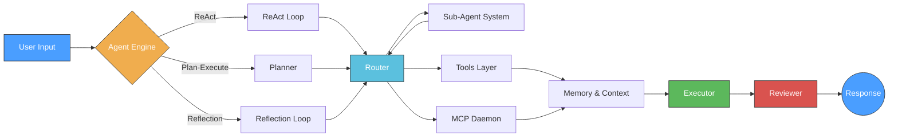

# OmniAgent

> Local multi-model AI Coding Agent CLI with ReAct, Plan-Execute, MCP tools, memory & TUI

<p align="center">
  
  
  
  
  
</p>

<p align="center">
  <b>📖 中文文档 → <a href="README_CN.md">README_CN.md</a></b>
</p>

---

OmniAgent is a local-first AI coding assistant that brings multiple agent workflows, multi-model routing, and native MCP tool integration to your terminal. Built entirely in Python, it balances autonomy with safety through checkpoint protection, circuit breakers, and intelligent context management.

---

## Quick Start

```bash
# Install
pip install omniagent

# (Optional) Set your API key
export DEEPSEEK_API_KEY="sk-..."
# Or use any supported provider

# Launch interactive TUI
omniagent

# Launch CLI mode
omniagent --cli

# Run a one-shot task
omniagent "Refactor the login module to use async/await"
```

### Configuration

On first run, OmniAgent creates a configuration file at `~/.omniagent/config.yaml`. You can set your default model, provider, agent mode, and other preferences:

```bash
# Set up provider credentials
omniagent /setup

# Switch model on the fly
omniagent /model claude-sonnet-4-20250514

# Switch agent mode
omniagent /mode react
```

---

## Features

- **Multi-Provider LLM Support** — DeepSeek, OpenAI, Claude, Gemini, Qwen, and local models via Ollama
- **Multiple Agent Workflows** — ReAct (reasoning + acting), Plan-Execute (decompose then execute), Reflection (self-critique loop)
- **MCP Tool Integration** — Native support for the Model Context Protocol with a daemon process and auto-restart (max 3 retries)
- **Sub-Agent System** — Delegate sub-tasks to child agents via a ReAct-driven engine
- **Modern TUI** — Textual-based terminal UI with a Zeekr-style dark theme, 7 card types, status bar, and shortcut hints
- **Reliability Layer** — Checkpoint backups before destructive writes, circuit breaker (3 consecutive failures triggers cooldown), context compaction at 80% window
- **Memory System** — Persistent session memory with lifecycle management
- **Rich Command System** — 20+ slash commands for runtime configuration and control

---

## Supported LLM Providers

| Provider     | Models                                     |
|-------------|--------------------------------------------|
| DeepSeek    | deepseek-chat, deepseek-reasoner           |
| OpenAI      | gpt-4o, gpt-4o-mini, o3, o4-mini          |
| Anthropic   | claude-sonnet-4-20250514, claude-haiku-3-5 |
| Google      | gemini-2.5-pro, gemini-2.5-flash           |
| Alibaba     | qwen-plus, qwen-max, qwen-turbo            |
| Ollama      | Any locally served model                   |

---

## Agent Workflows

### ReAct (Reason + Act)

The default agent loop. The model reasons about the current state, decides on an action (tool call or response), observes the result, and repeats until the task is complete.

```
Thought → Action → Observation → Thought → Action → ... → Final Answer
```

### Plan-Execute

Decomposes complex tasks into a multi-step plan first, then executes each step sequentially. Ideal for tasks that require careful sequencing.

```
Task → Planner → [Step 1, Step 2, ...] → Executor → Step 1 → Step 2 → ... → Final
```

### Reflection

After generating a solution, the agent critiques its own output and iteratively improves it. Useful for code generation, writing, and problem-solving where quality matters.

```
Generate → Self-Critique → Refine → Self-Critique → ... → Final
```

---

## Terminal UI (TUI)

OmniAgent ships with a modern Textual-based TUI featuring a Zeekr-style dark theme.

### Card Types

The TUI renders agent activity as scrollable cards:

| Card                | Purpose                                       |
|---------------------|-----------------------------------------------|
| `ToolCallCard`      | Displays a tool invocation with its arguments |
| `ToolResultCard`    | Shows the result returned by a tool           |
| `ThinkingCard`      | Renders the model's chain-of-thought          |
| `ApprovalCard`      | Prompts for user confirmation before actions  |
| `SystemCard`        | System-level messages and notifications       |
| `ErrorCard`         | Error messages with stack trace hints         |
| `SessionCard`       | Session metadata and context summary          |

### UI Elements

- **Status Bar** — Shows current model, agent mode, token usage, and iteration progress
- **Shortcut Hint Bar** — Appears after each engine response, listing available keyboard shortcuts
- **Multi-line Input** — `Shift+Enter` inserts a newline; `Enter` submits

---

## Command Reference

| Command            | Description                                    |
|-------------------|------------------------------------------------|
| `/setup`          | Configure provider credentials and preferences |
| `/model`          | Switch the active LLM model                    |
| `/mode`           | Switch agent workflow (react/plan/reflect)     |
| `/project`        | Set or view project context                    |
| `/edit`           | Request a code edit with LLM assistance        |
| `/mcp`            | Manage MCP tools and daemon                    |
| `/memory`         | Inspect or clear session memory                |
| `/compact`        | Manually trigger context compaction            |
| `/session`        | Session lifecycle management                   |
| `/notes`          | Persistent per-session notes                   |
| `/runs`           | View run history and statistics                |
| `/policy`         | Configure safety and approval policies         |
| `/provider`       | Switch or reconfigure LLM provider             |
| `/tools`          | List all available tools                       |
| `/status`         | Display current session status                 |
| `/stream`         | Toggle streaming output on/off                 |
| `/verbose`        | Toggle verbose logging                         |
| `/new_terminal`   | Open a new terminal for sub-processes          |
| `/open`           | Open a file in the default editor              |

---

## Architecture

OmniAgent follows a pipeline architecture where each stage has a clear responsibility:

```
User Input
    │
    ▼
┌─────────────────────────────────────────────────────┐
│                  Agent Engine                        │
│  (Planner / ReAct / Reflection)                     │
│    │                                                 │
│    ▼                                                 │
│  Router ──────► Tools Layer ──────► MCP Daemon      │
│    │             │                    │              │
│    │             ▼                    ▼              │
│    └─────► Memory & Context       External Tools     │
│               │                                      │
│               ▼                                      │
│           Executor ──────► Reviewer                  │
└─────────────────────────────────────────────────────┘
    │
    ▼
  Response / File Modifications
```

### Pipeline Breakdown

1. **User Input** — Accepts natural language or slash commands via CLI or TUI
2. **Agent Engine** — Routes to the active workflow (ReAct, Plan-Execute, or Reflection)
3. **Sub-Agent System** — The ReAct engine can spawn child agents for parallel or dependent sub-tasks
4. **Router** — Dispatches tool calls and manages the model selection strategy
5. **Tools / MCP** — Built-in tools plus any MCP server tools; the MCP daemon auto-restarts on failure (up to 3 attempts)
6. **Memory & Context** — Maintains conversation history, session state, and performs compaction when needed
7. **Executor** — Applies the agent's decisions (file writes, shell commands, etc.)
8. **Reviewer** — Validates results and detects errors before returning to the user



---

## Reliability & Safety

### Checkpoint System

Before any destructive file write, OmniAgent creates a timestamped backup. Checkpoints are automatically cleaned up after **14 days**.

```
Before write:  src/auth.py
Checkpoint:    .omniagent/checkpoints/src/auth.py.20260514T123045.bak
After write:   src/auth.py (modified)
```

### Circuit Breaker

If the agent encounters **3 consecutive failures** (tool errors, model timeouts, or invalid responses), the circuit breaker activates and enforces a cooldown period. This prevents cascading failures and gives the system a chance to recover.

### Context Compactor

When the token window reaches **80% capacity**, a 6-stage structured compression process is triggered:

1. Summarize conversation history
2. Prune low-value tool call details
3. Condense code snippets
4. Merge redundant messages
5. Preserve critical context (user goals, constraints, session state)
6. Re-index the compressed context

The process runs transparently and does not interrupt the active session.

---

## Session Lifecycle

| Artifact      | Retention | Description                              |
|---------------|-----------|------------------------------------------|
| Sessions      | 7 days    | Inactive sessions auto-expire            |
| Run Records   | 30 days   | Task execution history and metrics       |
| Checkpoints   | 14 days   | Pre-write file backups                   |

Sessions are managed via `/session` commands. Expired artifacts are cleaned up automatically on idle or at session start.

---

## Evaluation

The built-in eval suite runs **20 tasks** covering code generation, debugging, refactoring, file operations, shell commands, multi-step planning, and tool orchestration.

| Metric          | Result       |
|-----------------|--------------|
| Tasks Passed    | 20 / 20      |
| Pass Rate       | 100%         |
| Tool Calls      | 36           |
| Failures        | 0            |

---

## Development

```bash
# Clone the repository
git clone https://github.com/xianyu-sheng/omniagent.git
cd omniagent

# Install development dependencies
pip install -e ".[dev]"

# Run the test suite
pytest

# Run the eval suite
omniagent --eval

# Type-check new modules
mypy src/omniagent/
```

### Code Quality

- **mypy strict** — Required for all new modules; existing code is gradually being migrated
- **ruff** — Comprehensive ruleset covering pycodestyle, pyflakes, isort, and more
- All contributions must pass type checks and linting before merging

---

## License

[MIT](LICENSE) © 2025 Xianyu Sheng

---

<p align="center">
  <i>Built with Python, Textual, and a lot of coffee.</i>
</p>
<p align="center">
  <a href="https://github.com/xianyu-sheng/omniagent">GitHub</a> •
  <a href="https://github.com/xianyu-sheng/omniagent/issues">Issues</a> •
  <a href="https://github.com/xianyu-sheng/omniagent/discussions">Discussions</a>
</p>
