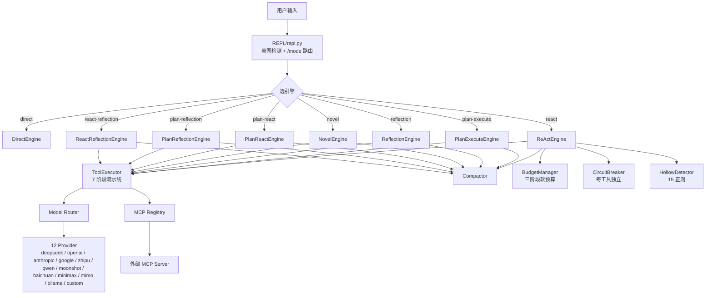
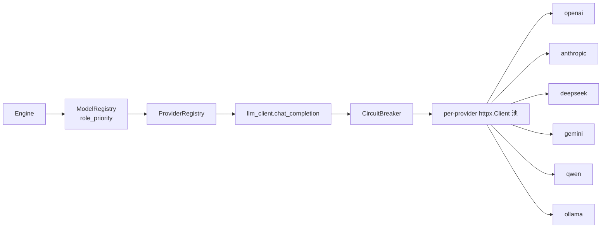
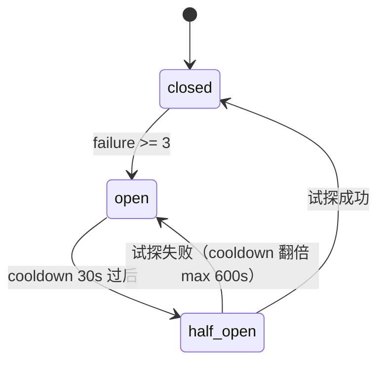
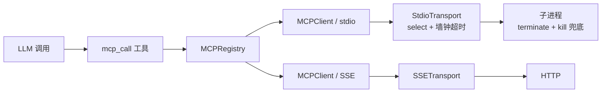

# OmniAgent Architecture

> 8 种推理范式共享一套基础设施：`BaseEngine` 抽象 + 路由层 + 三件套 + 工具执行门面。
> 本文按"引擎 → 路由 → 三件套 → 工具 → MCP"的层次组织。

---

## 顶层视图



---

## 1. 8 种推理范式

所有引擎继承自 [`BaseEngine`](omniagent/engine/base.py)，共享：
- `_call_llm` 统一 LLM 调用 + 错误分类（401/403/400 立即上抛，429/5xx/网络切模型）
- `_call_with_tools_once` 统一 function-calling 能力
- `_maybe_compact_messages` 每 5 轮自动压缩抑制 O(n²) 增长（F4）
- `_history_messages` 消费 ctx_mgr 历史不再 `[-10:]` 截断（F4）
- `_begin_run` / `interrupt` / `_reset_interrupt` 统一 run_id 链路追踪

### 1.1 分类

| 类别 | 引擎 | 适用场景 |
| --- | --- | --- |
| **直答** | `Direct` | 简单问答，无需工具 |
| **循环** | `ReAct` | 工具调用循环（读文件 / 跑命令 / MCP） |
| **计划** | `PlanExecute` | 多步任务自动分解 + 拓扑并行（PlanDAG） |
| **审查** | `Reflection` | 执行 + 独立审查者模型多轮评审 |
| **创意** | `Novel` | 长文续写 / 创意写作（Q5） |
| **组合 1** | `PlanReact` | 先做计划，再 ReAct 工具循环 |
| **组合 2** | `PlanReflection` | 计划 → 执行 → 独立模型审查 |
| **组合 3** | `ReactReflection` | 工具循环 → 独立模型审查 |

### 1.2 共享 vs 特化

```mermaid
classDiagram
    class BaseEngine {
        <<abstract>>
        +_call_llm()
        +_call_with_tools_once()
        +_maybe_compact_messages()
        +_history_messages()
        +_begin_run()
        +interrupt()
    }
    BaseEngine <|-- DirectEngine
    BaseEngine <|-- ReActEngine
    BaseEngine <|-- PlanExecuteEngine
    BaseEngine <|-- ReflectionEngine
    BaseEngine <|-- NovelEngine
    BaseEngine <|-- ReactReflectionEngine
    PlanExecuteEngine <|-- PlanReactEngine
    PlanExecuteEngine <|-- PlanReflectionEngine
    PlanReactEngine: 隔离 ctx + PlanDAG
    PlanReflectionEngine: 隔离 ctx + PlanDAG + reviewer
    ReactReflectionEngine: 隔离 ctx + 工具循环 + reviewer
```



**组合引擎的关键设计**（v0.2.0 Q9 修复）：父/子引擎用**隔离上下文**，失败步骤不污染共享 ctx；reviewer 模型用独立 `reviewer_model_priority`（E4）可与执行者不同。

### 1.3 Plan-Execute 的 PlanDAG

`PlanExecuteEngine._plan` 生成步骤列表（带 `depends_on` 依赖图），`PlanDAG` 拓扑波次并行：

```python
class PlanDAG:
    def waves(self) -> list[list[Any]]:
        """返回拓扑波次，每波内可并行执行（ThreadPoolExecutor）。"""
        # 构建依赖图 → 检测循环 → DAG→串行回退 → 失败级联跳过（v0.2.0 §8.27.1 修复）
```

`PlanExecuteEngine` 提供两条路径：
- `_run_dag` — 拓扑波次并行（默认）
- `_run_serial` — 串行回退（DAG 失败兜底，向后兼容）

---

## 2. 模型路由层



### 2.1 三层抽象

- **`ModelRegistry`**（`omniagent/repl/model_registry.py`）—— 角色级优先级
  - `role_priority: dict[str, list[str]]` — 同一角色下 `["deepseek/deepseek-v4-pro", "openai/gpt-4o"]` 自动降级
  - `model_id` 格式：`provider/model_name`（如 `anthropic/claude-3-5-sonnet`）
- **`ProviderRegistry`**（`omniagent/repl/provider_registry.py`）—— provider 端点配置
- **`llm_client.chat_completion`**（`omniagent/utils/llm_client.py`）—— 实际 HTTP 调用
  - 原生 function-calling 能力
  - **per-provider `httpx.Client` 长连接池**（v0.2.0 R3 修复，10+ 次并发复用）
  - 捕获真实 `usage`（prompt/completion/total tokens + latency）→ `UsageTracker`（Q1）

### 2.2 错误处理（R1）

- **终端错误**（401 / 403 / 400）：立即上抛，不重试
- **瞬时错误**（429 / 5xx / 网络）：切到 `role_priority` 下一个模型
- **全部失败**：`on_error` 回调 + 抛 `RuntimeError`

---

## 3. 工程化三件套

### 3.1 Compactor（F3 / F4）

`ContextManager.compact()` 在 Token 窗口达 80% 时触发，**6 步结构化压缩**：

1. 提取最近 6 轮对话
2. LLM 生成 6 段式摘要（背景/任务/工具调用/结果/约束/下一步）
3. 校验摘要长度（避免压缩后反而更长）
4. 安全截断（避免在代码块中间切断）
5. 替换历史
6. 持久化到 `~/.omniagent/compact/<session_id>.md`

**in-run 自动压缩**（F4）：`BaseEngine._maybe_compact_messages` 在每 5 轮触发一次，**抑制 O(n²) 增长**。`ctx_mgr` 注入引擎后，引擎消费压缩后历史不再 `[-10:]` 截断。

### 3.2 BudgetManager（F2）

**三阶段软预算**（Q2）：

| 阶段 | 占比 | 行为 |
| --- | --- | --- |
| EXPLORE | 前 25% | 鼓励探索，信息型工具不受限 |
| EXECUTE | 中段 50% | 正常执行 |
| CONVERGE | 末 25% | 禁用 7 个纯探索型工具，强制收束 |

**奖励机制**（软预算核心）：
- `on_compression()`：上下文被压缩（省 token）→ +N 轮
- `on_hollow_answer()`：检测到空洞回答 → +N 轮（给机会补救）
- `max_total_multiplier=2×` —— bonus 封顶，防止失控

**CONVERGE 禁用工具**（防止拖延）：`list_files` / `search_files` / `code_index` / `ast_analyze` / `diff_preview` / `web_fetch` / `github_fetch`。`read_file` **不**禁用——收束阶段仍允许"读一次验证"。

### 3.3 CircuitBreaker（F1 / Q3 Stage 4）



- `failure_threshold=3` 默认（**3 连续失败**触发）
- `cooldown=30s`，half_open 失败翻倍，**max 600s**
- 进程级 `GLOBAL_BREAKERS` 跨 run 累积

### 3.4 HollowDetector（F2）

3 类信号（任一成立即判空洞）：

1. **快速失败**：`len < 5` — 过短不可能有实质内容
2. **不成比例**：`tool_calls >= 5 && len < 100` — 做了大量工具调用却几乎不汇报
3. **正则 + 组合判定**：命中 15 个反模式正则 **AND**（长度不足 OR 结构差）
   - "接下来我将"、"综上所述"、"建议您..." 等 15 个套话
   - 组合判定的 `AND` 是为降假阳：合法详细总结可能含"综上所述"，但只要够长 + 有代码/路径等实质结构，就不判空洞

---

## 4. 工具执行（F1 / Q3 Stage 4）

`ToolExecutor`（`omniagent/nodes/tool_executor.py`）—— 7 阶段流水线门面，**所有引擎共用**：

| 阶段 | 名称 | 说明 |
| --- | --- | --- |
| 0 | 工具存在性 | 工具是否已注册（含 `register_tool` 动态注册） |
| 1 | 标准化 | 参数 `normalize_params`（v0.2.2 修复天气 `city` 丢失） |
| 2 | 参数幻觉校验 | LLM 是否捏造了不存在的参数 |
| 3 | 权限闸门 | 敏感操作 / 凭证路径黑名单（`SENSITIVE` 暂不拦截，仅记录，可接 `PermissionManager`） |
| 4 | 断路器 | `CircuitBreaker.allow()` — OPEN 状态直接拒绝 |
| 5+6 | 执行 + 重试 | 委托 `ToolNode` 实际执行 + 重试 |

### 4.1 内置工具（20 项，v0.2.2 全量审查）

| 类别 | 工具 |
| --- | --- |
| 文件 | `read_file` / `write_file` / `edit_file` / `edit_with_llm` / `batch_write` / `batch_edit` / `diff_preview` |
| 检索 | `search_files` / `code_index` / `ast_analyze` / `list_files` |
| 命令 | `command`（带 SSRF 拦截、命令注入收口、敏感路径黑名单） |
| Git | `git`（带危险命令拦截） |
| 网络 | `web_fetch`（带 SSRF 黑名单 + 已知安全域名白名单）/ `github_fetch`（v0.2.2 修复 `re` 导入位置） |
| 时间 | `datetime` |
| 动态 | `register_tool`（模式 2 only，模式 1 RCE 收敛；`react_engine` 默认不暴露给 LLM） |
| MCP | `mcp_call` — 调用外部 MCP 服务器 |

### 4.2 安全收口

- **SSRF 黑名单**：RFC 1918 私有网（10/8, 172.16/12, 192.168/16）+ RFC 6598 共享地址空间（100.64/10）+ IPv6 ULA（fc00::/7）。v0.2.2 修复 `198.18.0.0/15` 误拦（替换 `ipaddress.is_private` 为显式 RFC 检查）
- **SSRF 白名单**：`wttr.in` / `api.github.com` / `raw.githubusercontent.com` / `httpbin.org` 等公认公共 API
- **命令注入收口**：`command` 工具 dangerous tokens 拦截
- **路径黑名单**：`.ssh/` / `.aws/` / `credentials` / `*.key` / `*.pem`
- **凭证存 `~/.omniagent/credentials.yaml`**，不进仓库

---

## 5. MCP 集成



### 5.1 双传输

- **`StdioTransport`**（`omniagent/mcp/transport.py`）—— 通过子进程 stdio 通信
  - `select` + 墙钟 deadline 替代阻塞 `readline`（v0.2.0 **B11 修复**）
  - `max_lines` 上限防止被无关通知/日志无限消耗
  - 关闭用 `terminate()` + `wait(timeout=5)` + 兜底 `kill()`
- **`SSETransport`** —— 通过 HTTP Server-Sent Events 通信

### 5.2 命名空间

- 工具统一 `server:tool` 格式（如 `github:create_issue`）
- `MCPRegistry.tool_map: dict[str, tuple[str, dict]]` 跨多服务器聚合
- `mcp_call` 工具支持两个参数：`tool_name` + `tool_args`

### 5.3 已知后续项

- **MCP server 不自动重启**——子进程挂掉需要 `/mcp add` 重新添加（v0.3.0 路线）

---

## 6. 运行时支持

- **CLI 入口**：`omniagent.main:cli` → `omniagent` 命令
- **REPL**：`omniagent/repl/repl.py` — TUI 7 卡片 + 状态栏 + 快捷键
- **凭据存储**：`~/.omniagent/credentials.yaml`（chmod 0600）
- **会话历史**：`~/.omniagent/sessions/`
- **压缩归档**：`~/.omniagent/compact/`
- **快捷键**：`/setup` / `/set_model` / `/mode` / `/mcp` / `/memory` / `/compact` / `/project` 等

---

## 7. 设计文档与历史

- [`docs/omniagent-design-spec-v1.1.html`](omniagent-design-spec-v1.1.html) — 原始设计文档 v1.1
- [`docs/OPERATION_GUIDE.md`](OPERATION_GUIDE.md) — REPL 命令手册
- [`CHANGELOG.md`](../CHANGELOG.md) — 版本变更（v0.1.0 → v0.2.2）
- [`docs/reports/v0.2.2/`](reports/v0.2.2/) — 端到端测试报告 + 独立验证报告
